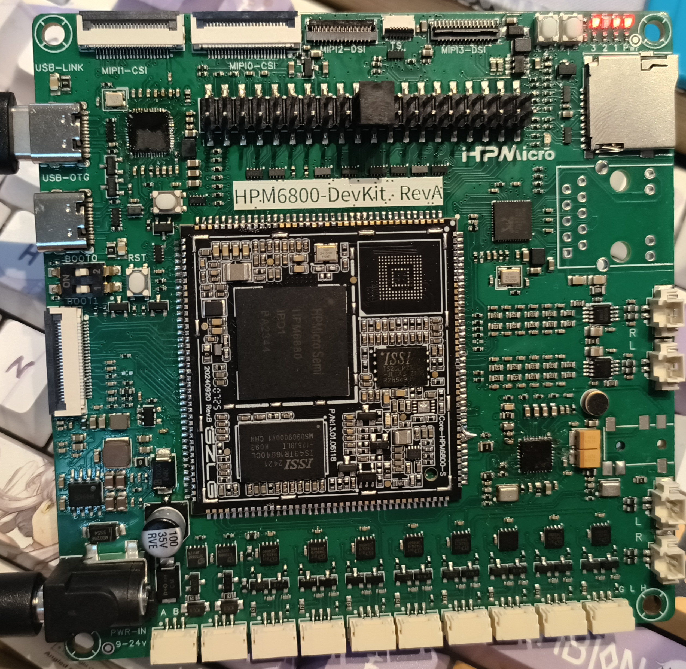

# 基于ZLG HPM68核心板的HPM6800HMI开发板

基于HPM6880核心板的HMI开发板，集成cmsis-dap下载器、4路MIPI、DVP、千兆以太网、音频codec、8路CAN、2路RS485，DC9-24V电源输入。

- boards下有创建的板子Pinmux
- compoents/pannel下有增加适配的两款MIPI屏幕
  jd9365da_31b:8 inch,1280*800p
  jd9522z_31b:5.5 inch,1920*1080p

板子硬件开源:https://oshwhub.com/hasaki6/hpm68-hmi
